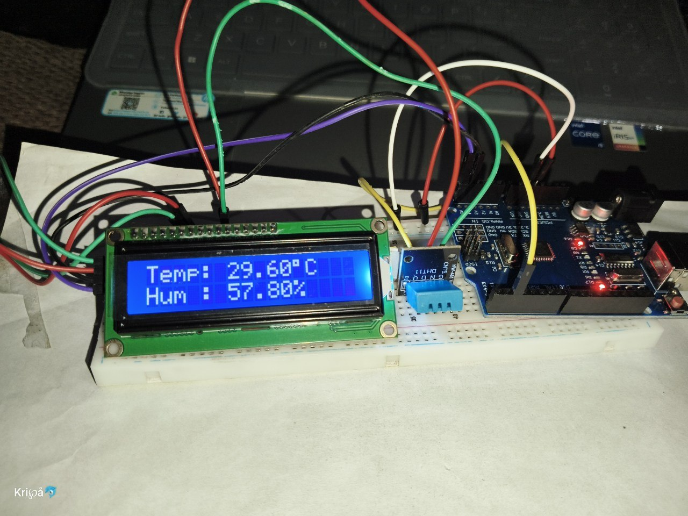
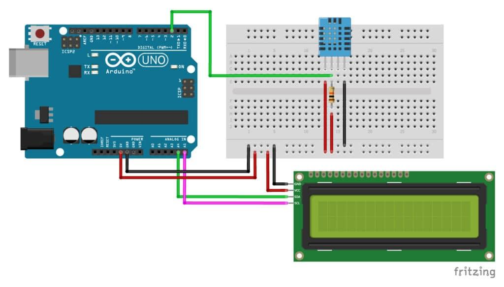

# 🌡️ Arduino Temperature & Humidity Monitor

A simple and beginner-friendly Arduino project that measures real-time temperature and humidity using a DHT11 sensor and displays the values on a 16x2 I2C LCD display.

---

## 📸 Project Preview



## 
🎥 YouTube Demo
[Watch Demo Video](https://youtube.com/shorts/FKAMFJkV61E?si=GZupgGJCulnriWsy)


---

## 🚀 Features

- Real-time temperature monitoring
- Real-time humidity monitoring
- LCD display output
- Easy wiring and coding
- Beginner-friendly electronics project

---

## 🧩 Components Used

- Arduino UNO
- DHT11 Temperature & Humidity Sensor
- 16x2 I2C LCD Display
- Jumper Wires
- Breadboard
- USB Cable

---

## 🔌 Connections

### DHT11 Sensor

| DHT11 Pin | Arduino UNO |
|---|---|
| VCC | 5V |
| GND | GND |
| DATA | D2 |

### 16x2 I2C LCD

| LCD Pin | Arduino UNO |
|---|---|
| VCC | 5V |
| GND | GND |
| SDA | A4 |
| SCL | A5 |

---

## 💻 Libraries Used

- DHT Sensor Library by Adafruit
- LiquidCrystal_I2C

---

## 📟 Working

The DHT11 sensor reads temperature and humidity values from the environment. Arduino processes the data and displays the output on the 16x2 LCD screen in real time.

---

## 📂 Files Included

```text
Arduino-Temperature-Monitor
│
├── Arduino_Temp_Monitor.ino
├── README.md
├── output.jpg
├── circuit.jpg
└── thumbnail.png
```

---

## 🎥 YouTube Shorts

Watch the project on YouTube Shorts and support the channel 🚀

Channel Name: **Tsar Tech**

---

## 📌 Hashtags

#Arduino #DHT11 #Electronics #DIY #ArduinoProject #LCD #HumiditySensor #TemperatureSensor #TechShorts #TsarTech

---

## 👨‍💻 Author

Made with ❤️ by **Tsar Tech**
